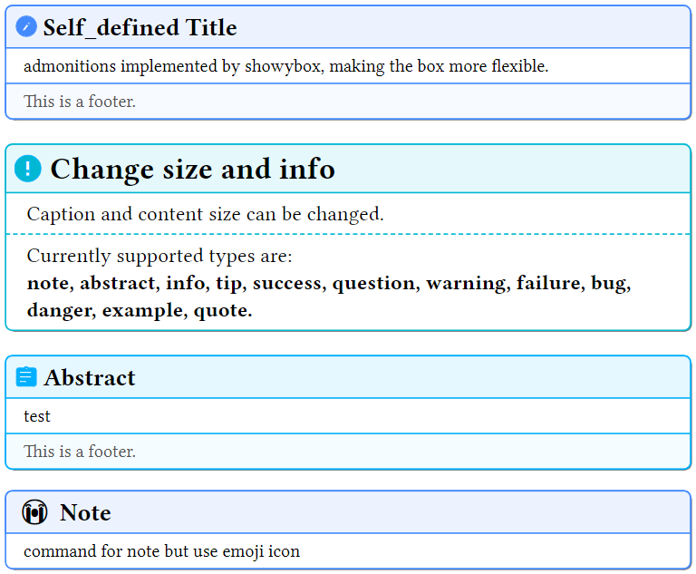
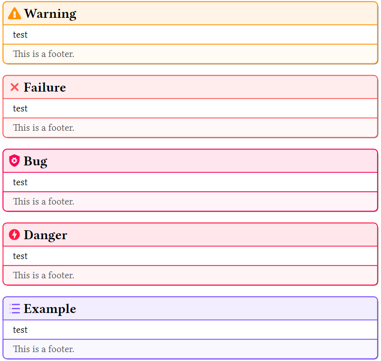

# typst-admonition

[This package](https://github.com/crd2333/typst-admonition) is admonitions in [typst](https://github.com/typst/typst).

Icons are redrawed from [material](https://squidfunk.github.io/mkdocs-material/reference/admonitions/).



## Usage

```typst
#import "/path/to/typst-admonition/lib.typ": *

#info(caption: "This is a caption")[
  Cpation can be self defined if determined, otherwise it will be the same as the type.

  Currently supported types are:\
  note, abstract, info, tip, success, question, warning, failure, bug, danger, example, quote.
]
```